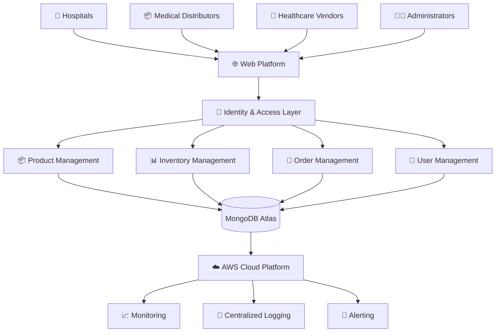
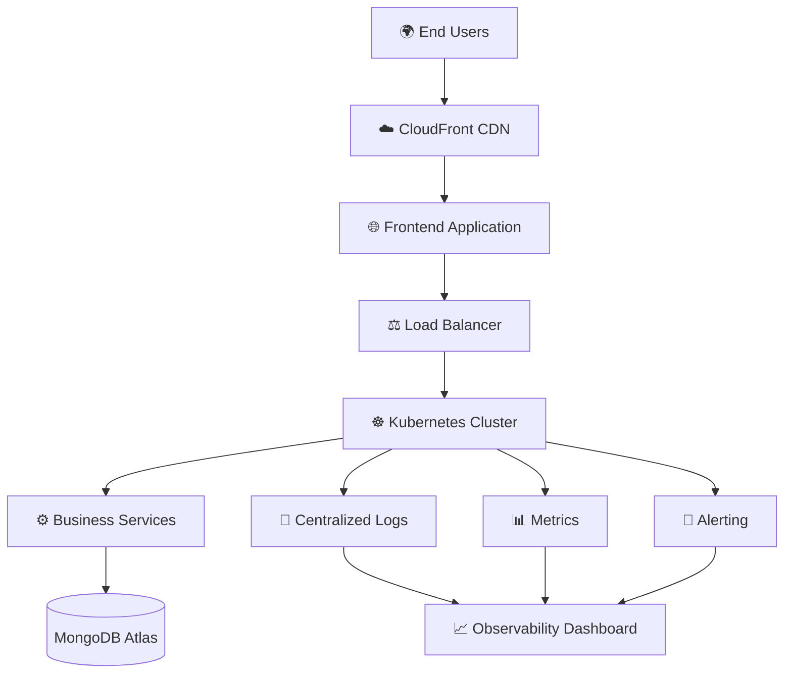

# 🏥 B2B Medical ERP System

### Enterprise Healthcare Supply Chain & Inventory Management Platform

 

 

> **Production-Grade Cloud-Native ERP Platform for Hospitals, Medical Distributors & Healthcare Vendors**

 

**Microservices • AWS • Kubernetes • Terraform • Jenkins • DevSecOps**

---

## 🎯 Enterprise Capabilities

✅ Cloud-Native Healthcare ERP

✅ Enterprise Microservices Architecture

✅ Inventory & Supply Chain Management

✅ Product Lifecycle Management

✅ Order & Procurement Automation

✅ JWT Authentication & RBAC

✅ Kubernetes Orchestration

✅ Infrastructure as Code

✅ CI/CD Automation

✅ Container Security Scanning

✅ Production Deployment Strategy

✅ Enterprise Scalability

---

## 📊 Platform Overview

| Architecture  | Deployment | Security   | Database      |
| ------------- | ---------- | ---------- | ------------- |
| Microservices | Kubernetes | JWT + RBAC | MongoDB Atlas |

| Cloud | IaC       | CI/CD   | Containers |
| ----- | --------- | ------- | ---------- |
| AWS   | Terraform | Jenkins | Docker     |

---

# 📌 Project Overview

B2B Medical ERP System is a cloud-native healthcare supply chain platform built to streamline inventory management, procurement workflows, product distribution, and order processing across healthcare organizations.

The platform follows modern enterprise architecture principles using distributed microservices, containerized deployments, Kubernetes orchestration, Infrastructure as Code, and automated CI/CD pipelines.

The project demonstrates real-world DevOps practices commonly used in enterprise cloud environments.

---

# 💼 Business Challenges Solved

Healthcare organizations often face:

* Manual inventory tracking
* Procurement inefficiencies
* Limited stock visibility
* Delayed order processing
* Scalability constraints
* Lack of centralized operational management

EduBlitz Medical ERP addresses these challenges through automation, cloud-native infrastructure, and secure digital workflows.

---

# 🏗️ Enterprise Solution Architecture

---

# ⚡ Technology Ecosystem

| Layer          | Technology              |
| -------------- | ----------------------- |
| Frontend       | React, TypeScript, Vite |
| Backend        | Spring Boot, Java       |
| Database       | MongoDB Atlas           |
| Authentication | JWT, RBAC               |
| Containers     | Docker                  |
| Orchestration  | Kubernetes              |
| Cloud Platform | AWS                     |
| Infrastructure | Terraform               |
| CI/CD          | Jenkins                 |
| Security       | Trivy, SonarCloud       |

---

# 🔄 Business Workflow

### 🔐 Authentication & Authorization

Secure user onboarding and role-based access management.

### 📦 Product Management

Centralized product catalog management for healthcare inventory.

### 📊 Inventory Tracking

Real-time stock visibility and inventory control.

### 🛒 Procurement & Ordering

Automated ordering and procurement workflows.

### ☁️ Cloud Operations

Scalable cloud-native deployment architecture.

### 📈 Monitoring & Observability

Centralized monitoring, logging, and operational visibility.

---

# ⚙️ DevOps Delivery Pipeline

```mermaid
flowchart LR

Developer[👨‍💻 Developer]

Developer --> GitHub[GitHub Repository]

GitHub --> Jenkins[Jenkins Pipeline]

Jenkins --> SonarCloud[📊 SonarCloud]

SonarCloud --> Trivy[🔒 Trivy Security Scan]

Trivy --> Docker[🐳 Docker Build]

Docker --> Registry[📦 Container Registry]

Registry --> Kubernetes[☸️ Kubernetes Cluster]

Kubernetes --> Production[🚀 Production Environment]

Production --> Monitoring[📈 Monitoring & Alerts]
```

---

# ☁️ Cloud Infrastructure Architecture

---

# 🔐 Security Implementation

✅ JWT Authentication

✅ Role-Based Access Control (RBAC)

✅ Secure API Communication

✅ Environment Isolation

✅ Container Security Scanning

✅ Security Quality Gates

✅ Infrastructure Security Practices

✅ Cloud-Native Security Controls

---

# 🚀 DevOps & Cloud Engineering

* Microservices Deployment Strategy
* Kubernetes Orchestration
* Infrastructure as Code (Terraform)
* CI/CD Automation
* Cloud-Native Application Design
* Containerization with Docker
* Security Scanning & Compliance
* Production Deployment Workflow
* Monitoring & Observability

---

# 📈 Key Learning Outcomes

This project demonstrates practical implementation of:

* AWS Cloud Architecture
* Kubernetes Administration
* Terraform Infrastructure Automation
* Jenkins CI/CD Pipelines
* Docker Containerization
* DevSecOps Practices
* Enterprise Microservices
* Cloud-Native Deployments
* Production Operations

---

# 🚀 Future Roadmap

* Prometheus Monitoring
* Grafana Dashboards
* GitOps with ArgoCD
* Service Mesh Architecture
* Event-Driven Communication
* Redis Caching Layer
* AI-Based Demand Forecasting
* Advanced Analytics Dashboard

---

# 👨‍💻 Author

### Suryakant Kulkarni

**Cloud & DevOps Engineer**

AWS • Kubernetes • Terraform • Jenkins • Docker • DevSecOps

---

## ⭐ Enterprise Application • Cloud Native • DevOps Driven

**Healthcare • Automation • Cloud • Kubernetes • Security • Scalability 🚀**

